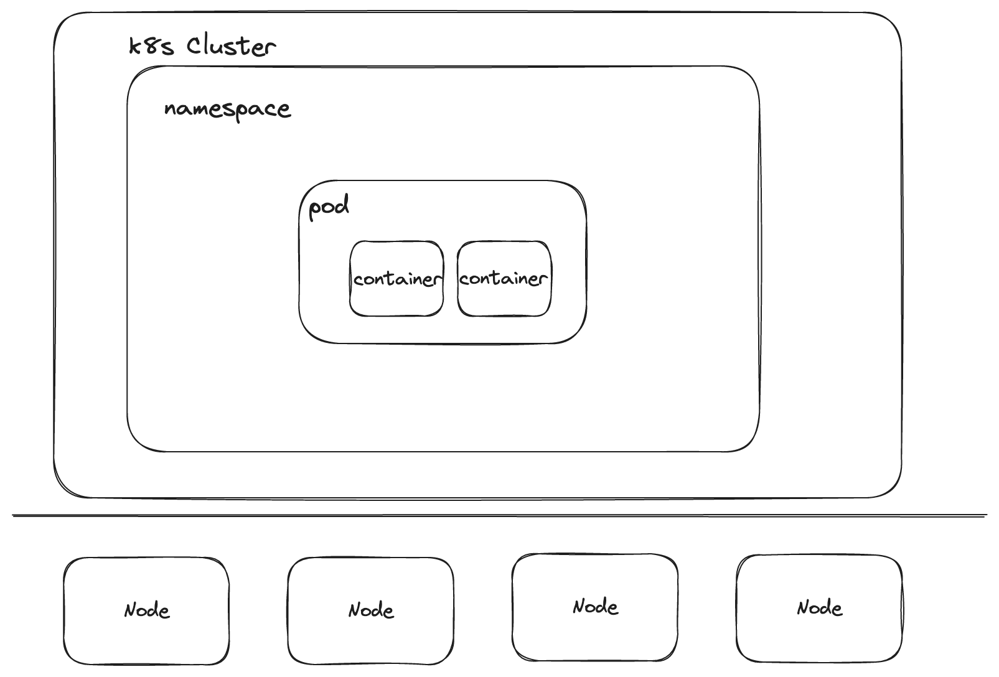

# K8s 101
Software you need for this workshop:
* [Docker](https://docs.docker.com/get-docker/)
* [kubectl](https://kubernetes.io/docs/tasks/tools/#kubectl)
* [kind](https://kind.sigs.k8s.io/docs/user/quick-start/#installation)
* unix environment (Linux, MacOS of WSL)
* Decent editor with YAML schema validator (e.g. [YAML language server](https://github.com/redhat-developer/yaml-language-server) ) - Optional
* [jq](https://stedolan.github.io/jq/) and [yq](https://github.com/mikefarah/yq), json and yaml processors
* [k9s](https://k9scli.io/) - Optional

## Theory



Kubernetes is often shortened to K8s (there are 8 letters between K and s).

### Containers
Are a unit of functionality that addresses a single concern. A container image is self-contained and defines and 
carries its runtime dependencies.

### Pods
A Pod is an atomic unit of scheduling, deployment, and runtime isolation for a group of containers.  
The only way to run a container is via pod!
All containers in a Pod are always scheduled to the same host, are deployed and scaled together, and can also share 
filesystem, networking, and process namespaces.  
Containers within a pod interact via localhost. From outside, a pod looks like a single unix machine and has a single IP.  
Pods are ephemeral. IP is assigned only after a pod is scheduled.

### Services
Service binds service name to IP and port. It's a named entry for accessing applications.
Service usually points to a set of pods. Services also provide load balancing.

### Namespaces
Provide a way of dividing k8s resources. Provide scopes for Kubernetes resources and a mechanism to apply 
authorizations and other policies to a subsection of the cluster.  
Can be used for staging (e.g. dev, test, prod), can also be used to achieve multitenancy.

## Further Reading
The [official kubernetes documentation is quite good](https://kubernetes.io/docs/home/), note this doesn't extend to a lot of other projects in the kubernetes ecosystem. Have a look at their
[tutorials](https://kubernetes.io/docs/tutorials/) or the [explanation of pods](https://kubernetes.io/docs/concepts/workloads/pods/).

Some other literature we can recommend:
* [Kubernetes App Development](https://matthewpalmer.net/kubernetes-app-developer/), very short but gets you very well started
* [Kubernetes in Action](https://www.manning.com/books/kubernetes-in-action-second-edition), very thorough,
  1st edition somewhat outdated, 2nd edition only available as a preview
* [Kubernetes Patterns](https://www.oreilly.com/library/view/kubernetes-patterns-2nd/9781098131678/), a bit more advanced material

## Getting started
We first need a Kubernetes distribution. For local development, [kind](https://kind.sigs.k8s.io) is a good fit.
It stands for Kubernetes In Docker and runs a whole cluster within docker.  

### Note about registry
We need a way of hosting container images to deploy on k8s. For common apps public registries (e.g. Docker Hub) 
are used. For development purposes we can host a registry locally. Use `00_kind/start_kind_with_registry.sh` 
to start a kind cluster with registry linked to it.  

#### Potential problems
If the script complains about ports being taken, use the following command to find the process occupying port 5001
and kill it.
```shell
sudo lsof -i -n -P | grep TCP | grep 5001
```

## Starting a cluster
```shell
kind create cluster
```
or with registry:
```shell
sh 00_kind/start_kind_with_registry.sh
```

## Deleting a cluster
```shell
kind delete cluster
```

## Interacting with cluster - kubectl

```shell
kubectl cluster-info # or kubectl cluster-info --context kind-kind

# Get available contexts
kubectl config get-contexts
# Set kind-kind context to be default context
kubectl config use-context kind-kind

# Get nodes
kubectl get nodes # short: kubectl get no
# Get nodes
kubectl get namespaces # short: kubectl get ns
# Get all pods
kubectl get pods -A # short: kubectl get po -A
```
### kubectl
Command line tool for interaction with k8s clusters. 

`kubectl <command> <resource> <options>`

Commands:
* get
* create
* describe
* replace
* apply
* delete

#### Context management
The default config file for `kubectl` is `~/.kube/config`. This file defines clusters and users and links them as contexts. You can list and select the contexts with the `kubectl config` command.
```shell
kubectl config get-contexts
kubectl config use-context <context-name>
```

As it is more convenient, most users use one file per cluster (per context, to be precise). Using the `.kubeconfig` file extension is also common. You can tell kubectl to use a different config file by setting the `KUBECONFIG` environment variable to the path of the file. `kubectl` will then automatically set the current context to the one defined in the file.
```shell
export KUBECONFIG=~/.kube/mycluster.kubeconfig
```

## Deploying stuff
Single command:
```shell
kubectl run alpine --image=alpine -- sleep 600
```

While it may be convenient to use `kubectl run` to deploy pods, the preferred way is to use manifests.
Manifests are yaml (or json) documents, describing resources you want to deploy on k8s. Here's an example:

```yaml
apiVersion: v1
kind: Pod
metadata:
  name: hello-world
  # namespace: default
spec:
  containers:
    - name: hello-container
      image: alpine
      command: [ "/bin/sh" ]
      args:
        - "-c"
        - |
          echo "Hello, World!"
          sleep 3600
```

### Pods
Deploying:
```shell
kubectl apply -f 01_intro/00_hello_world_pod.yaml
```
Inspecting:
```shell
kubectl get po -n default
# Getting logs
kubectl logs hello-world -n default
# Getting state
kubectl describe pod hello-world -n default
# Getting manifest
kubectl get po hello-world -n default -o yaml # | yq
```
Debugging:
```shell
# Exec a command in a pod
kubectl exec -it hello-world -- sh
```
Within pod shell:
```shell
ps ax # PID 1 is the main container process
ls / # we see regular unix filesystem
```

Deleting:
```yaml
kubectl delete pod hello-world -n default
```

## What is a pod?

```
kubectl explain pod
```
Also works for all other objects.

### Deployments
Deployment enables declarative updates for Pods and ReplicaSets - i.e.
manages Pods and ReplicaSets.  

Deploying:
```shell
kubectl apply -f 01_intro/01_hello_world_deployment.yaml
```

Inspecting:
```yaml
kubectl describe deploy hello-world-deployment
# Inspect replica set that controls pod
kubectl describe replicaset hello-world-deployment-<REPLACE>
# Inspect pod
kubectl describe pod hello-world-deployment-<REPLACE>
```

Deployment makes sure there is always enough pods available. Try deleting a pod:
```yaml
kubectl delete pod hello-world-deployment-<REPLACE>
```
What happens?

## Custom applications/container images
For this section to work you have to have a local registry!

### Basic example
Building an image and pushing it to local registry.
```shell
cd 02_custom_applications/00_alpine_python
docker build . -t localhost:5001/alpine-python:0.1

# test locally with docker
docker run -it localhost:5001/alpine-python:0.1

docker push localhost:5001/alpine-python:0.1
```

deploy a pod that uses the new image:

```shell
kubectl apply -f 02_custom_applications/00_hello_world_pod_python.yaml
```

### Pack everything into container
For proper applications you want to pack your code inside a container.
```shell
docker build . -t localhost:5001/python-hello:0.1
# test with docker
docker run localhost:5001/python-hello:0.1
# push to registry
docker push localhost:5001/python-hello:0.1
```

deploy:
```shell
kubectl apply -f 02_custom_applications/01_python_app.yaml
```

## Networking and Services
`Services` forward networking requests to groups of pods selected by labels.

Apply an example echo pod and accompanying service and have a look at the yaml
file:

```shell
kubectl apply -f 03_services/pods_and_service.yaml
```

Check the output `kubectl get svc -o wide`.

Forward the port of the service and the single pod:

```shell
kubectl port-forward service/echo-service 8081:8080
```

```shell
kubectl port-forward echo-server-1 8082:80
```

Test the services with curl:

```
curl localhost:8081
curl localhost:8082
```

That service is now reachable under the pods ip on port 80 inside the cluster,
on port 8080 on the services IP and name `echo-service.default.svc.cluster.local` (also
only inside the cluster) and also on port 30888 on the nodes IP (e.g. your
localhost), but only if kind is configured as required (see
[kind docs](https://kind.sigs.k8s.io/docs/user/configuration/#extra-port-mappings)).

Try it from curl from inside your cluster:

```bash
kubectl run curlpod --image=curlimages/curl -i --tty -- sh
```


Deploy a second pod with the same label:

```bash
kubectl apply -f 03_services/second_pod.yaml
```

observe what happens when you curl against the service, use
`kubectl logs -f <pod-name>`.

Delete both pods (`kubectl delete pod <pod-name>`) and try to curl against the
service.

Then deploy `03_services/echo-deployment.yaml`.

Services and deployments work well together, but one does not require the other.


## Namespaces
Namespaces (or short ns) divide your cluster into several virtual clusters.

Check the namespaces currently installed (`kubectl get ns`).

Create a new namespace:

```shell
kubectl create ns my-custom-ns
```
and check if it has been created, then delete it.

Create a new namespace from the `custom_ns.yaml` file:

```shell
kubectl apply -f 04_namespaces/custom_ns.yaml
```

What is the name of that namespace?

Some resources are namespaced (like pods or deployments), others are not (like
namespaces themselves).

By default, `kubectl` uses the default namespace. You can use the `-n
<namespace>` flag to specify a namespace for most kubectl commands.

Try to create a deployment in the "custom-application" namespace.


## Config maps and secrets
A ConfigMap holds configuration data that pods can consume.  
A Secret is similar to a ConfigMap but is intended specifically for sensitive data. Can hold raw or base64-encoded secrets.  

Data from ConfigMaps can be exposed in a pod as an environmental variable or mounted as a file.  
Variable example:
```shell
kubectl apply -f 05_configmaps/my_cm.yaml
kubectl apply -f 05_configmaps/00_hello_cm_deployment.yaml
kubectl logs deployment.apps/hello-cm-deployment
```
Modify configmap and restart deployment:
```shell
kubectl  rollout restart deployment.apps/hello-cm-deployment
# check if the change was picked up (may take some time)
kubectl logs deployment.apps/hello-cm-deployment
```

ConfigMap mounted as a file:
```shell
kubectl apply -f 05_configmaps/01_mount_cm_pod.yaml
kubectl logs pod/mount-cm-pod
# Jump into the pod and check if that file exists
kubectl exec -it mount-cm-pod -- sh
```

## Storage
K8s was meant for ephemeral workloads (no state saved inside the cluster).
By default, the filesystem is gone after your pod is terminated.

Let's see how this works.

Have a look at `06_storage/app.py`. It's a simple webserver that returns the
number of requests it has answered until now. That data is persisted locally
into a file called `counter.txt`. Run it with `python 06_storage/app.py` and go
to `http://localhost:8000`. Refresh the site several times. Kill the python
process, restart it, and restart the website.

Build the app as a Docker container:

```
docker build . -t localhost:5001/python-counter:0.1
docker push localhost:5001/python-counter:0.1
```

Create the app as a k8s service: `kubectl apply -f
06_storage/counter_service.yaml` and go to `http://localhost:30888`. Reload and
the number should increase.

Now restart the deployment: `kubectl rollout restart deployment counter-deployment` and reload the webpage. Your count is gone.


#### Let's make this persistent

Have a look at `06_storage/counter_service_persistent.yaml` and deploy it and
increase the counter. Then delete the pod or restart the deployment. What does
the counter say?

Have a look at:

* `kubectl get pvc`
* `kubectl get pv`
* `kubectl get sc`

Delete the deployment. Have a look at pvcs, pvs, and scs again.
Redeploy, check your counter. Where is our data?

#### Let's make this even more persistent
Have a look at `06_storage/counter_service_more_persistent.yaml` and do the same as
above.

hostPath is a terrible idea for production, especially if you have a multi node
cluster (unless you really know what you are doing).

#### Storage is hard on k8
Especially if you are not in the cloud.


#### Note: Deployments are not great for what we did above

Use StatefulSets instead:

StatefulSets in Kubernetes are a workload API object used to manage stateful applications, which are characterized by having a unique network identity and stable, persistent storage. Unlike other Kubernetes objects, like ReplicaSets or Deployments, each pod in a StatefulSet has a unique, sticky identity tied to its ordinal index, hostname, and optional stable network ID (derived from a headless Service). This identity is consistent across rescheduling, making it suitable for applications that require stable network identifiers, persistent storage, and ordered, graceful deployment and scaling. Examples of such applications include databases, key-value stores, and anything else that relies on a stable network identity or persistent data.

## Installing applications
### Helm vs Kustomize
Helm:
* Imperative
* Templating
* Packages
* Added abstraction
* Not natively supported

Kustomize:
* Declarative
* Built into kubectl
* Works on plain yamls/manifests
* Minimal
* Overlays/patches

### Helm
[Website](https://helm.sh/)  
Based around templates called "charts".

If you haven't installed helm: `brew install helm`

[Artifact Hub](https://artifacthub.io/packages/search?kind=0) is a central
repository for helm charts.

Let's install grafana as an example:

```
helm repo add grafana https://grafana.github.io/helm-charts
helm repo update
helm install mygrafana grafana/grafana
```

`grafana/grafana` is the chart (first grafana is the repo, second grafana is the
chart), `mygrafana` is the name of the installed "release".

Have a look at what pods, services, deployments etc. were created.

Let's delete it again: 
```
helm uninstall mygrafana
```
(sometimes there are leftovers).

Next time, install into a specific namespace with `-n <namespace>`. If the
namespace doesn't exist yet, helm can create it for us: `--create-namespace`.

Let's change some settings.

What settings exist?
```
helm show values grafana/grafana
```
or see website.

Let's change the admin username and password:
```
helm install mygrafana grafana/grafana -f 07_app_installation/helm/grafana_values.yaml
```

Try to login with the settings from `grafana_values.yaml`.

Want to use a NodePort with the service? Try to use `grafana_values2.yaml`.

Want to see (or use) the manifests?
```
helm template grafana/grafana -f 07_app_installation/helm/grafana_values_2.yaml
```

Helm also supports role-backs and lots of other cool things.
Reasonably easy to create your own charts, including dependecies on other
charts.

#### Why not helm?
Hard to customize anything that creators of a chart didn't think about.


### Kustomize

Use cases:
- Patches
- Replacing a variable
- Replacing image
- Generating configmaps

The kustomize documentation can be found here: [Kustomize](https://kubectl.docs.kubernetes.io/guides/)

Want to test a kustomization without applying it? You can do a dry run to see what the resulting yamls would look like:  
```
kubectl kustomize path/to/kustomization/
```

Want to apply it? You can use either command:  
```
kubectl apply -k path/to/kustomization/
kubectl kustomize path/to/kustomization | kubectl apply -f -
```

Want to delete the kustomization?  
```
kubectl delete -k path/to/kustomization/
```

## Jobs
CronJob documentation can be found here: [CronJob Docu](https://kubernetes.io/docs/concepts/workloads/controllers/cron-jobs/).  
  
Cron syntax is explained here: [Cron Syntax](https://en.wikipedia.org/wiki/Cron).
  
Have a look at `08_jobs/cronJob/`.

## RBAC

RBAC = Role Based Access Control

Consists of `Role`s (surprise!) and `RoleBinding`s. Roles set permissions to do
something with specified resources while RoleBindings bind the Rules to Users,
Groups, or Service Accounts.

`ServiceAccount`s provide identities to processes running on k8s when they contact
the k8s API.

`Role`s and `RoleBinding`s are namespaced. There are also `ClusterRole` and
`ClusterRoleBinding` which are not namespaced but valid cluster wide.

Resources are all the API Objects we have already met (`Pod`s, `Service`s,
`Deployment`s, etc.)

Verbs are the operations on for those resources. Which operations exist somewhat
depends on the objects. The classics are `create`, `delete`, `get`, `list`,
`patch`, `update`, `watch`.

Have a look at the existing `ServiceAccounts`, `ClusterRoles`, and
`ClusterRoleBindings`.

## Interlude: Operators
Operators provide a way to package, deploy, and manage a
Kubernetes application in a more automated and scalable manner. These are
essentially software extensions that use custom resources to manage applications
and their components. They often use Custom Resource Definitions (CRDs) and
Custom Resources (CRs) (we won't use those).

We will now use [shell-operator](https://github.com/flant/shell-operator) to
write our own operator. The operator will create a new `echo` pod in each newly
created namespace.

Have a look at `09_rbac/operator_example/complete.yaml`.

## Back to RBAC

Apply `09_rbac/operator_example/operator.yaml`, and create a new namespace (e.g.
`kubectl create ns test`) observe the logs.
You should see some permission denied messages. This is because our operator
doesn't have the right permission yet. Check
`09_rbac/operator_example/service_account.yaml` to see how we add a new
ServiceAccount, ClusterRole and ClusterRoleBinding.

Apply, create another test namespace, check the logs. What is still missing?
Have a look at `09_rbac/operator_example/complete.yaml` and see the last missing
permissions. Create another namespace.

## Users

The K8s API does not have a concept of users. Instead, if you have a certificate
sign by the cluster's CA, the common name (CN) of that certificate is your user
name, the organisation fields (O) are the groups you belong to.

Check your current username:

```
CERTIFICATE_DATA=$(kubectl config view --raw -o jsonpath='{.users[?(@.name == "kind-kind")].user.client-certificate-data}')
echo $CERTIFICATE_DATA | base64 --decode > cert.pem
openssl x509 -in cert.pem -text -noout
rm cert.pem
```

Find out which `ClusterRoleBinding` exist for your username or group.

## Create a new user
You can create a new user by creating a new X509 certificate and get it signed
by the k8s CA.

Have a look at the script in `09_rbac/users/generate_role_for_user.sh` to see
how it is done. The example script expects to create a user with the same name
as an existing namespace. Run the script (e.g. `USER=ops bash generate_role_for_user.sh` and test access: 
`kubectl get pods -n ops --kubeconfig ops-config/ops.config`.

You can check if you are allowed to do a specific operation with `kubectl auth
can-i create pods`.

*You can also use something like keycloak for authentication against the API.*
  
Lots of chances to mess this up. Some good hints in the
[k8s docs](https://kubernetes.io/docs/concepts/security/rbac-good-practices/).


## Resources

You can specify how many resources your containers (containers, not pods!)
should consume. 

[The k8s
documentation](https://kubernetes.io/docs/concepts/configuration/manage-resources-containers/)
is short but thorough.

You can set resources for cpu, memory and hugepages, each for limits and
requests.

In practice:
* For CPU: do not use limits, but requests for all pods
* For Memory: requests = limits

You can also specify limits for namespaces, see `ResourceQuotas`.

In `10_resources` you can find a simple pod description that can be executed
with low and high (cpu) limits, execute them and check the logs how long the
computation took.
